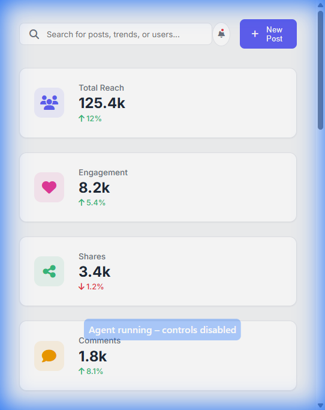
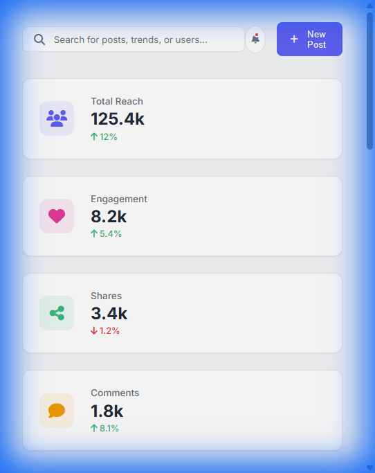
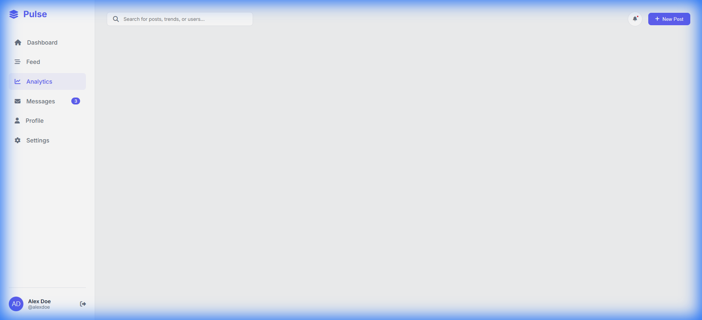
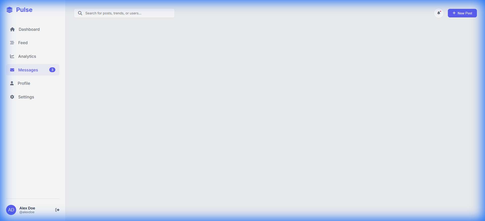

# Pulse - Social Media Dashboard

A minimalist, data-driven social media dashboard designed for media monitoring and publishing. This project features a clean UI/UX with dynamic content rendering and a fully responsive layout.



## 🚀 Features

- **Dynamic Feed**: Real-time style feed updates with posts, images, and engagement stats.
- **Analytics Visualization**: Visual representation of audience growth and engagement rates using CSS and SVG.
- **Interactive Navigation**: Seamless switching between Dashboard, Feed, Analytics, Messages, Profile, and Settings views.
- **Messaging System**: Integrated chat interface with a contact list.
- **User Profile**: Detailed profile view with cover image, stats, and post history.
- **Responsive Design**: Fully fluid layout that adapts from desktop to mobile screens.

## 🛠️ Technologies Used

- **HTML5**: Semantic structure.
- **CSS3**: Grid/Flexbox layout, CSS variables for theming, and custom animations.
- **JavaScript (Vanilla)**: DOM manipulation, dynamic data rendering, and navigation logic.
- **Font Awesome**: Iconography.
- **Google Fonts**: 'Inter' typeface for a clean, modern look.

## 📂 Project Structure

```
social_media_dashboard/
├── img/
│   ├── dashboard_preview.png
│   ├── feed_preview.png
│   ├── analytics_preview.png
│   ├── messages_preview.png
│   ├── profile_preview.png
│   └── settings_preview.png
├── index.html       # Main application structure
├── style.css        # Styles and responsive design
├── script.js        # Application logic and navigation
├── data.js          # Mock data source
└── README.md        # Project documentation
```

## 📸 Screenshots

### Feed & Analytics

| Feed View                       | Analytics View                            |
| ------------------------------- | ----------------------------------------- |
|  |  |

### Messages & Profile

| Messages View                           | Profile View                          |
| --------------------------------------- | ------------------------------------- |
|  |  |

## 📦 How to Run

1. Clone the repository.
2. Open `index.html` in your browser.
3. Navigate through the sidebar to explore different sections.

---

© 2024 Pulse Dashboard. All rights reserved.
